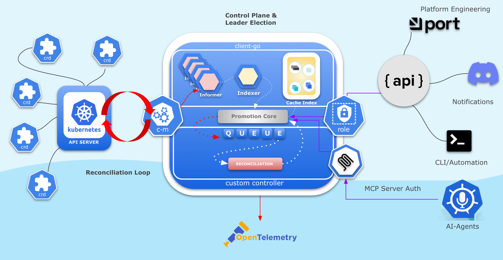

# Golang Kubernetes Controller Tutorial

This project is a step-by-step tutorial for DevOps and SRE engineers to learn about building Golang applications and Kubernetes controllers. Each step is implemented as a feature branch and includes a README section with explanations and command history.

## Roadmap

This tutorial guides you through building a production-grade Golang Kubernetes controller, step by step:

1. **Golang CLI Application using Cobra** — Initialize a CLI app with cobra-cli.
2. **Zerolog for Log Levels** — Add structured logging with zerolog.
3. **pflag for Log Level Flags** — Integrate pflag for CLI log level flags.
4. **FastHTTP Server Command** — Add a server command with configurable port and log level.
5. **Makefile, Dockerfile, and GitHub Workflow** — Introduce build automation, secure containerization, CI/CD, and tests.
6. **List Kubernetes Deployments with client-go** — List deployments in the default namespace.
7. **Deployment Informer with client-go** — Watch and log Deployment events.
8. **/deployments JSON API Endpoint** — Serve deployment names as JSON from the informer cache.
9. **controller-runtime Deployment Controller** — Reconcile Deployments and log events.
10. **Leader Election and Metrics** — Add HA and metrics endpoint to the controller manager.
11. **FrontendPage CRD and Advanced Controller** — Define a custom resource and manage Deployments/ConfigMaps.
12. **Platform API (CRUD + Swagger)** — Add RESTful CRUD API and Swagger UI.
13. **MCP Integration** — Integrate MCP server for multi-cluster management.
14. **JWT Authentication** — Secure API endpoints with JWT.
15. **OpenTelemetry Instrumentation** — Add distributed tracing with OpenTelemetry.

---


## Dev Environment (GitHub Codespaces)
### Recommended way: 
 - 1. develop and test your code with envtest k8s control plane first (we use it on step7)
 - 2. test controller with local kind cluster (find example)
 - 3. deploy controller as helm chart in production cluster (use helm chart from step10)
      
```sh
#### Install brew
/bin/bash -c "$(curl -fsSL https://raw.githubusercontent.com/Homebrew/install/HEAD/install.sh)"
eval "$(/home/linuxbrew/.linuxbrew/bin/brew shellenv)"
### Install kind
brew install kind
### Install K9S for cluster management
curl -sS https://webi.sh/k9s | sh
### Create kind cluster
kind create cluster
### Add some usefull aliases
alias kk="EDITOR='code --wait' k9s"
alias k=kubectl
## Run complete controller setup
 go run main.go
```
